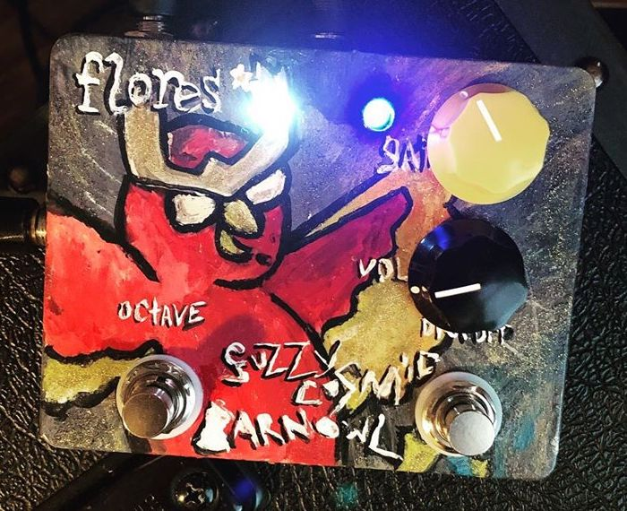

Some stuff I do for fun!!! 

## [Pedalboy](https://github.com/hugofloresgarcia/pedalboy)

a super cool SuperCollider pedalboard app with lots of lfos lower-level controls, and full midi support :)!  

## [Automaton](https://github.com/hugofloresgarcia/automaton)

A cellular automata note (and granular) sequencer built using SuperCollider.

## [Trees](/trees/)

tree garden!

# Compositions

## [Flowerbeds](https://github.com/hugofloresgarcia/flowerbeds)

Written using SuperCollider and openFrameworks
<iframe width="250" src="https://www.youtube.com/embed/1OFTEvNSGOg" frameborder="0" allow="accelerometer; autoplay; encrypted-media; gyroscope; picture-in-picture"></iframe>  

# Pedals

## Fuzzy cosmic barn owl

<body>

  

      
  

  

      
  

</body>

this is the fuzzy cosmic barn owl pedal. It's a 386 power amp distortion with an additional analog octave up circuit.

very cool, I promise.

art by jarrett thompson
